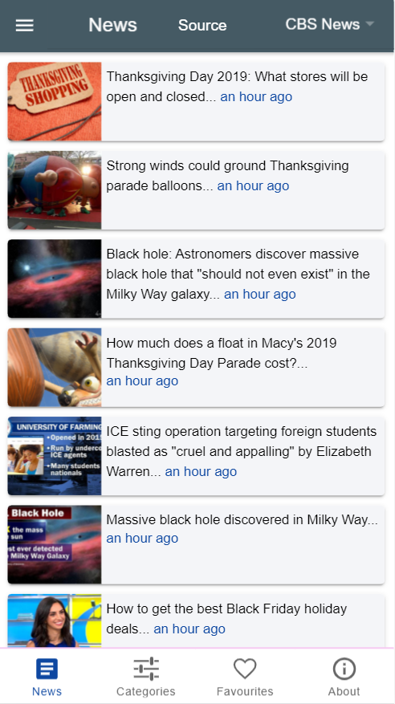
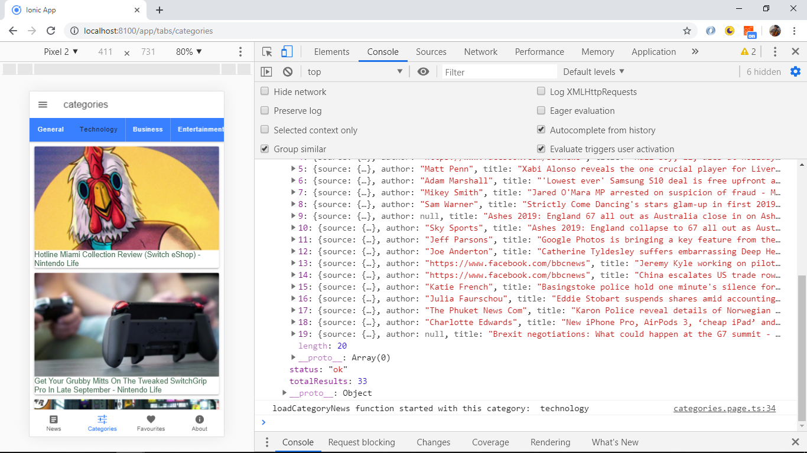
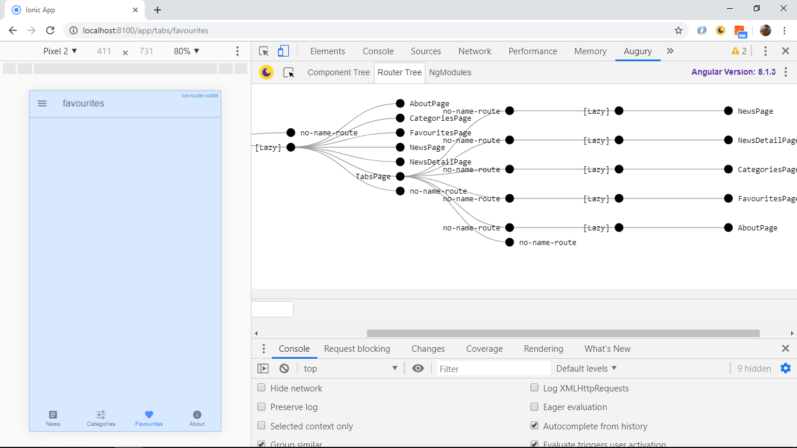
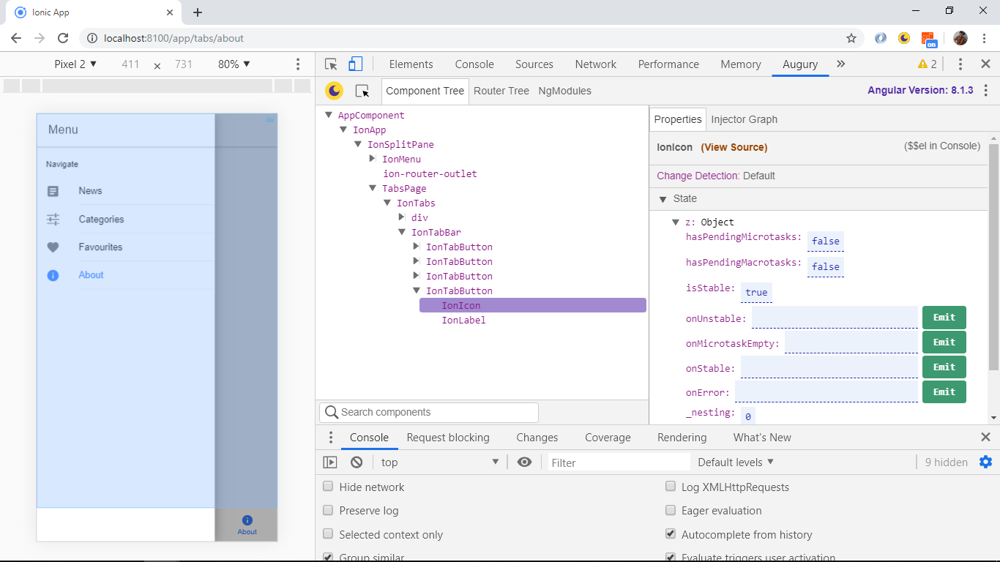

# Ionic Angular News App

App to search for and display news items from a [news API](https://newsapi.org/) using the [Ionic 5 framework](https://ionicframework.com/docs).

## Table of contents

* [General info](#general-info)
* [Screenshots](#screenshots)
* [Technologies](#technologies)
* [Setup](#setup)
* [Features](#features)
* [Status](#status)
* [Inspiration](#inspiration)
* [Contact](#contact)

## General info

* The [News API](https://newsapi.org/) is a simple HTTP REST API for searching and retrieving live articles from the web using:

1. Keyword or phrase
2. Date published
3. Source name
4. Source domain name
5. Language

## Screenshots

[Ionic page](./img/news-mobile9-16.png)





## Technologies

* [Ionic v5.4.9](https://ionicframework.com/)
* [Angular v8.2.3](https://angular.io/)
* [Ionic/angular v4.8.0](https://www.npmjs.com/package/@ionic/angular)
* [RxJS v6.5.2](https://reactivex.io/)
* [News REST API used to search for news articles](https://newsapi.org/)
* [IP Geolocation API](http://ip-api.com/)
* [Ionic Storage v2.2.0](https://ionicframework.com/docs/building/storage)
* [Ionic Native Network v5.13.0](https://ionicframework.com/docs/native/network)
* [Ionic Native Social-Sharing v5.13.0](https://ionicframework.com/docs/native/social-sharing)

## Setup

* It is necessary to [register with news API](https://newsapi.org/docs/get-started) to get an API key that is stored in the `environment.ts` file
* To start the server on _localhost://8100_ type: 'ionic serve'

## Code Examples

* function to identify the user's country and show news for that country when app first initialises.

```typescript
// array of countries served by the news API service - note it does not include Spain
const countryCodeArray = [
	'ae', 'ar', 'at', 'au', 'be', 'bg', 'br', 'ca', 'ch', 'cn', 'co',
	'cu', 'cz', 'de', 'eg', 'fr', 'gb', 'gr', 'hk', 'hu', 'id', 'ie',
	'il', 'in', 'it', 'jp', 'kr', 'lt', 'lv', 'ma', 'mx', 'my', 'ng',
	'nl', 'no', 'nz', 'ph', 'pl', 'pt', 'ro', 'rs', 'ru', 'sa', 'se',
	'sg', 'si', 'sk', 'th', 'tr', 'tw', 'ua', 'us', 've', 'za'
];

/* 
fetch user country via separate service function provider
fetch news for that country
use defaultCountry if country not in countryCode array
*/
this.newsService.getCountryCode().subscribe(
	data => {
		console.log('country code search: ', data);
		const countryData = data;
		this.countryCode = countryData.countryCode.toLowerCase();
		const checkedCountryCode = countryCodeArray
			.indexOf(this.countryCode.toLowerCase()) === -1 ? this.defaultCountry : countryData.countryCode.toLowerCase();
		console.log('Country code is: ', checkedCountryCode);
		this.newsStorageService.storeData('userCountry', checkedCountryCode.toString());
		this.getCountryNews(checkedCountryCode);
	}
)
```

## Features

* **Typescript interface** used to define the expected structure of the json object returned from the news API.
* **Separate providers (services)** page with API http fetch functions.
* **Custom pipes** used to modify API news article titles and derive '..time ago' from a date string.
* **Dark mode** switch on menu changes from light to dark mode.
* **Offline Storage** of favourite articles using Ionic Storage.
* **Network** status check in initialisation so latest news data is stored. Template data-binding always from stored data.
* **Common Refresh Component** dragging down will perform refresh function.
* **Common Progess Bar Component** ion-card shows while news loading on News, Categories and Favourites pages.
* **Localisation using i18n** so user can select between English (default), Spanish and French.

* [Ionic colour generator](https://ionicframework.com/docs/theming/color-generator) used to create color palette.

### Pages

* **Menu side-bar:** news, categories, favorites, search, about, change language, dark theme toggle.
**TODO:** add Image/logo at bottom?
* **News page** shows world headlines using an ion-card list. Card is only shown if it has an image - to avoid having news items with empty spaces. Shows time as '... ago'.
* **News-detail page** shows the selected news item in more detail with links to favourites. Title has news source end text removed using a custom Angular pipe as I show this information in the top toolbar. Uses another custom pipe to shows time as '... ago'. Includes working footer buttons for 'More info', which opens news source in a separate window and 'Favourite' which adds the article to a stored news array. Array symbol at end of article content string replaced with text using split and concat. Has social media share buttons. 
* **Categories page:** ion-segment used to show categories in a scrollable horizontal menu: Sport, Busines, Health, Technology, Science, General, Entertainment. Shows time as '... ago'.
* **Favourites page:** lists articles in reverse date order that have been saved by clicking on the favourites icon on the news-detail page. Sliding from the right now deletes the favourite.
**TODO:** prevent storage of duplicate articles. Add 'delete all' button at top. lhs sliding delete is not working.
* **About page** with popover with working links to Author Website and Github repo.

## Status

* Status: Working but not complete.

## To-do
1. Theme scss: improve colors - check dark theme.
2. Search: Add news search popover?
5. language change menu i18n - working for News page - expand to tabs etc.
6. News Detail page could use a footer so user can change pages?? go straight to favourites list?
7. Splash screen
8. Tabs bar - replace About with Search route or Weather?
9. Common article storage/access function.
10. Contact form
11. SqLite - use as default database?
12. Add to refresh function so News, Categories and Favourites is refreshed.

## Inspiration

* Some of project structure based on: [Ionic example app: 'A conference app built with Ionic to demonstrate Ionic'](https://github.com/ionic-team/ionic-conference-app).
* The code for checking network status is based on: [Ionic 4 Network Check Example Problem](https://forum.ionicframework.com/t/ionic-4-network-check-example-problem/157909/2).
* [Ionic Academy Tutorial: How to Localise Your Ionic App with ngx-translate](https://ionicacademy.com/localise-ionic-ngx-translate/) however language selected using ion-select-option dropdown list in side-menu (ie not using a popover page).
* [Regexr.com](https://regexr.com/) for developing and testing regex expressions.

## Contact

Repo created by [ABateman](https://www.andrewbateman.org) - feel free to contact me!
