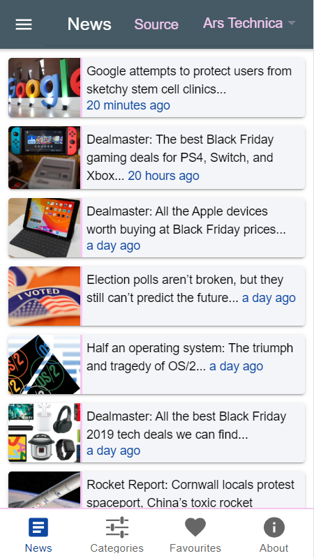
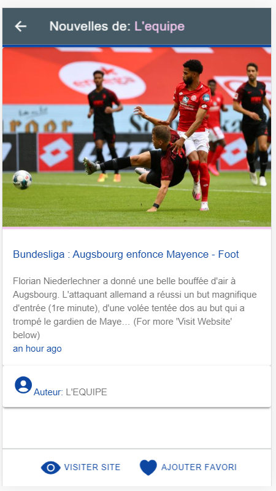
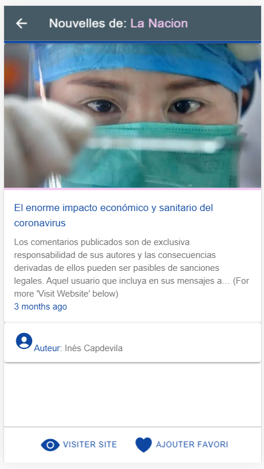
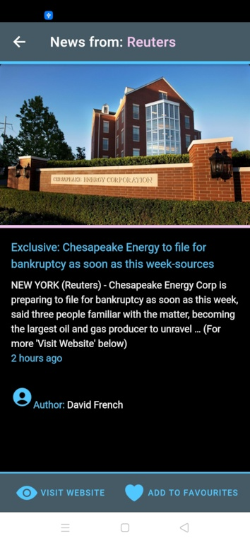

# :zap: Ionic Angular News App

* Displays news items from a [news API](https://newsapi.org/) using the [Ionic framework](https://ionicframework.com/docs).
* **Note:** to open web links in a new window use: _ctrl+click on link_


## :page_facing_up: Table of contents

* [:zap: Ionic Angular News App](#zap-ionic-angular-news-app)
  * [:page\_facing\_up: Table of contents](#page_facing_up-table-of-contents)
  * [:books: General info](#books-general-info)
  * [:camera: Screenshots](#camera-screenshots)
  * [:signal\_strength: Technologies](#signal_strength-technologies)
  * [:floppy\_disk: Setup](#floppy_disk-setup)
  * [:computer: Code Examples](#computer-code-examples)
  * [:cool: Features](#cool-features)
  * [:books: Navigation/Pages](#books-navigationpages)
  * [:clipboard: Status](#clipboard-status)
  * [:clipboard: To-do](#clipboard-to-do)
  * [:clap: Inspiration](#clap-inspiration)
  * [:file\_folder: License](#file_folder-license)
  * [:envelope: Contact](#envelope-contact)

## :books: General info

* The [News API](https://newsapi.org/) is a simple HTTP REST API for searching and retrieving live articles from the web.
* The [News API](https://newsapi.org/) now only works on localhost. It will not work when deployed due to CORS errors (error 406) which means they want you to pay a subscription to fully access the API. This app was successfully deployed to Android Studio - see screen shots below but I deleted the firebase depoyment. I will do another news app using the [Gnews](https://gnews.io/) API which has a free tier for up to 100 requests per day and 10 articles per search.
* [Codium AI](https://www.codium.ai/) used to check and improve code quality.

## :camera: Screenshots

|  |  |  |
| :----------------------------: | :----------------------------: | :---------------------------------------: |
|        News Page French        |       News Page Spanish        |             News Page English             |

|  |  |  |
| :----------------------------: | :----------------------------: | :---------------------------------------: |
|        News Detail Page French        |       News Detail Page Spanish        |             News Detail Page English             |

|  |  |  |
| :----------------------------------: | :----------------------------------: | :---------------------------------------------: |
|       Categories Page Business       |    Categories Page Entertainment     |               Article Detail Page               |

|  |  |  |
| :----------------------------------: | :----------------------------------: | :---------------------------------------------: |
|        Favourites Page Empty         |         Favourites Page Some         |              Favourites Page Full               |

|  |  |  |
| :-----------------------------: | :-----------------------------: | :----------------------------------------: |
|        About Page French        |     About Page + Side Menu      |           About Page + Info Menu           |

|  |  |  |
| :-----------------------------: | :-----------------------------: | :----------------------------------------: |
|        Dark Mode News Page       |     Dark Mode Categories+Menu Page      |           Dark Mode About Page           |

|  |  |  |
| :-----------------------------: | :-----------------------------: | :----------------------------------------: |
|        Android About Dark Page       |     Android About Light Page      |           Android Categories Dark Page           |

|  |  |  |
| :-----------------------------: | :-----------------------------: | :----------------------------------------: |
|        Android Detail Dark Page        |     Android Detail Dark Page      |           Android Detail Light Page           |

|  |  |  |
| :-----------------------------: | :-----------------------------: | :----------------------------------------: |
|        Android Favourites Light Page       |     Android Menu Dark Page      |           Android Menu Light Page           |

## :signal_strength: Technologies

* [Ionic v7](https://ionicframework.com/)
* [Angular v17](https://angular.io/)
* [Ionic/angular v7](https://www.npmjs.com/package/@ionic/angular)
* [RxJS v7](https://reactivex.io/)
* [News REST API](https://newsapi.org/) used to search for news articles. Requires API key
* [IP Geolocation API](https://ipapi.co/#api)
* [Ionic Storage v3](https://www.npmjs.com/package/@ionic/storage-angular) specific to Angular
* [Ionic ngx-Translate core v14](https://ionicframework.com/docs/v3/developer-resources/ng2-translate/)
* [Ionic Native Network v5](https://ionicframework.com/docs/native/network)
* [NGX-Translate internationalization library for Angular](http://www.ngx-translate.com/)
* [Ionic open source Ionicons](https://ionicons.com/)
* [Day.js Date Conversion module v1](https://www.npmjs.com/package/dayjs)

## :floppy_disk: Setup

* It is necessary to [register with news API](https://newsapi.org/docs/get-started) to get an API key that is stored in the `environment.ts` file
* To start the server on _localhost://8100_ type: `ionic serve`
* to add android platform: `ionic cordova platform add android`
* to create build file for android: `ionic cordova build android`
* to run on device plugged in via USB cable: `ionic cordova run android`
* Follow this link [to deploy to IOS or Android](https://ionicframework.com/docs/angular/your-first-app/6-deploying-mobile)

## :computer: Code Examples

* service to switch between dark/light display mode

```typescript
// enable dark or light mode from HTML toggle switch event via changeThemeMode() function
export class ThemeService implements OnInit{
  darkMode: boolean;
  renderer: Renderer2;

  constructor (
    private rendererFactory: RendererFactory2,
    private storage: Storage,
    @Inject(DOCUMENT) private document: Document
  ) {
    this.renderer = this.rendererFactory.createRenderer(null, null);
  }

  async ngOnInit() {
    await this.storage.create();
}

  enableDark() {
    this.renderer.addClass(this.document.body, "dark-theme");
    this.storage.set("dark-theme", true);
    this.darkMode = true;
  }

  enableLight() {
    this.renderer.removeClass(this.document.body, "dark-theme");
    this.storage.set("dark-theme", false);
    this.darkMode = false;
  }

  changeThemeMode(e: any) {
    e.detail.checked ? this.enableDark() : this.enableLight();
  }
}
```

## :cool: Features

* **ng Control Flow** latest `@if` and `@for` used in templates
* **Typescript interface** used to define the expected structures of the JSON objects returned from the news API
* **Separate providers (services)** page with API HTTP fetch RxJS observables
* **Custom pipes** used to modify API news article titles, contents and derive '..time ago' from a date string
* **Dark mode** Menu toggle changes from light to dark mode
* **Offline Storage** of dark mode status & favourite articles using Ionic Storage
* **Common Refresh Component** dragging down will perform refresh function
* **Common Progess Bar Component** ion-card shows while news loading on News, Categories and Favourites pages
* **Localisation using i18n** so user can select between English (default), Spanish and French
* **[Ionic colour generator](https://ionicframework.com/docs/theming/color-generator)** used to create color palette

## :books: Navigation/Pages

* **Nav side-bar:** news, categories, favorites, search, about, change language, dark theme toggle + Unsplash image with credit. Sidemenu is dismissed when the user clicks on a list item.
* **News page** shows world headlines using an ion-card list. Uses `@if` control flow to only show card if it has an image to avoid having news items with empty spaces (API data is not perfect). Shows time as '... ago' using a date convert pipe that uses day.js to convert the API Coordinated Universal Time (UTC) date-time string to '...ago'.
* **News-detail page** shows the selected news item in more detail. Title has news source end text removed using a custom Angular pipe as I show this information in the top toolbar. Also uses custom pipe to show time as '... ago'. Includes working footer buttons for 'More info', which opens news source in a separate window and 'Favourite' which adds the article to a stored news 'favourites' array. Array symbol at end of article content string replaced with text using split and concat. **Remove `<li>` from content text using regex** .
* **Categories page:** ion-segment used to show categories in a scrollable horizontal menu: Sport, Busines, Health, Technology, Science, General, Entertainment. So far categories only shown from English sources. Shows time as '... ago'.
* **Favourites page:** articles listed in reverse date-time order that have been saved by clicking on the favourites icon on the news-detail page. **Include popover that will let user delete all list items, sliding from the right deletes the favourite, prevent storage of duplicate articles. Add 'delete all' button at top. lhs sliding delete is not working.**
* **About page** Displays Unsplash image with author credit and short info about the app with links to APIs used. Header includes popover with links to Author Website, Github Repo and a Contact Page.

## :clipboard: Status

* Status: Working except including language on start-up menu, production build file created, successfully deployed to Android Studio

## :clipboard: To-do

* Disable clicking on menu icon when in news page.

## :clap: Inspiration

* [Angular Standalone Components Unleashed: Exploring the Magic of a World Without NgModule](https://blogs.halodoc.io/angular-standalone-components-unleashed-exploring-the-magic-of-a-world-without-ngmodule/)
* Some of project structure based on: [Ionic example app: 'A conference app built with Ionic to demonstrate Ionic'](https://github.com/ionic-team/ionic-conference-app)
* The code for checking network status is based on: [Ionic 4 Network Check Example Problem](https://forum.ionicframework.com/t/ionic-4-network-check-example-problem/157909/2)
* [Ionic Academy Tutorial: How to Localise Your Ionic App with ngx-translate](https://ionicacademy.com/localise-ionic-ngx-translate/) however language selected using ion-select-option dropdown list in side-menu (ie not using a popover page)
* [Regexr.com](https://regexr.com/) for developing and testing regex expressions
* [Shields badges for readme](https://shields.io)
* [Easy-Resize to resize images to a smaller file size](https://www.easy-resize.com/en/)
* [Font Awesome Free Icon svgs](https://fontawesome.com/icons?d=gallery&m=free)

## :file_folder: License

* This project is licensed under the terms of the MIT license.

## :envelope: Contact

* Repo created by [ABateman](https://github.com/AndrewJBateman), email: `gomezbateman@yahoo.com`
